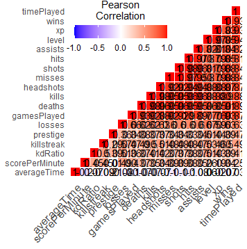
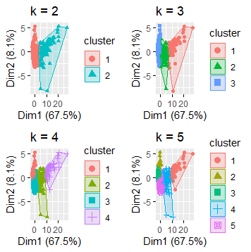
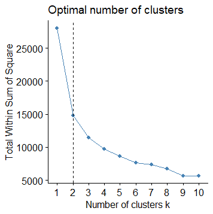
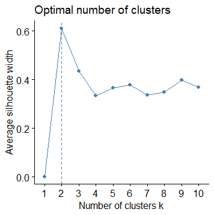
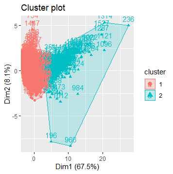

# Introduction

## Statement of the Problem

-   Video Games are an escape for people which makes it universally enjoyable
-   Call of Duty is the leader of First Person Shooting
-   New games come out once a year
-   The Goal of this presentation

## Relevance

-   The Kill/Death ratio

-   Gives an idea of the player's skill level

-   The amount of money that comes with Professional players

## Literature Review

-   Clustering algorithms seek hidden patterns in data sets that may exist
-   Patterns or similarities are then defined as groups or clusters
-   This technique is applied in many applications like pattern recognition and image processing
-   The k-means clustering algorithm was developed in 1967 by J.B. MacQueen

# K Means Clustering

## K Means Clustering - Basics

-   The clusters are each represented by a center point, a centroid
-   This centroid is found by an initial value, seed points
-   Then the k-means calculates the squared distance between the input data points
-   Thus assigns that value to the centroids

## K Means Clustering - Limitations

-   Number of clusters is predetermined
-   The results of k-means depend on the initials cluster centers
-   Algorithm contains the dead-unto problem
-   Knowing about your data is a must so that the proper number of clusters can be determined
-   Clusters if under the right circumstances can contain little to no data
-   Constraints can help with limitations

## K Means Clustering - Other Info

-   Clustering is used to find hidden groups in a Raw Data set
-   K-means clustering is numerical, unsupervised, and non-deterministic
-   The k-means algorithm consists of two separate phases
-   Phase one selects k random centers, where the value k is set in advance
-   Phase two takes each data object to the nearest center

# Methodology

## Data

-   The Data set comes from our friends at Kaggle
-   This dataset contains the in-game behaviors for over 1,000 players
-   There are 19 features from players name to time spent playing the game

## Data Features 1/3

-   name: this is the name for each player
-   wins : number of times the player win a match
-   kills : number of kills the player made in all his matches
-   kdRatio : kill/deaths ratio that means, if a player has 10 kills and 5 deaths, his KD ratio is equal to 2. A KD ratio of 1 means that the player got killed exactly as many times as he successfully eliminated his opponents
-   killstreak : kill a number of enemy players without dying.
-   level : is the player grade

## Data Features 2/3

-   losses : total number of losing
-   prestige: it is an optional Mode that players can choose after they progress to Level 55 and max
-   hits : number of times the player damaged another player
-   timePlayed : the time spent by every player playing Call of Duty in hours
-   headshots : number of times the player hit the others with head-shots
-   averageTime : average time
-   gamesPlayed : number of times the player plays a match

## Data Features 3/3

-   assists : number of times player damaging an enemy but a teammate gets the kill.
-   misses : the number of times the player miss the hit
-   xp : Experience Points (XP) are a numerical quantity exclusive to multiplayer that dictates a player's level and progress in the game.
-   scorePerMinute :a measure of how many points players are gaining per unit time.
-   shots : number of shots the player did
-   deaths : number of time the player got killed in the game.

## Pearson Correlation

{width="600" height="362"}

-   First we created a heatmap of correlations to see if there are any patterns that immediately stick out

## Process

-   First step in the scaling process is to decide how many clusters we want generated in the final output
-   K-means algorithm will randomly select k objects from the data to serve as initial centroids
-   Each remaining data points are assigned to its closest centroid as measured by Euclidean distance between each object and the cluster mean
-   Then the algorithm finds the new mean value for each cluster

## Ending the Process

-   Each observation is checked again and reassigned if there is a new closest centroid
-   Process ends when the cluster assignments stop changing
-   The process by which assignments stop changing is called "convergence"

## Cluster Results

## Choosing an Appropriate amount of Clusters

-   Elbow method

-   This method vary the amount of clusters, k, and compute the clustering algorithm

-   Calculate the total within-cluster sum of squares (wss) for each k

-   Plot the curve of wss based on k

-   Where the curve "elbows" or bends significantly is indication of the optimal number of clusters to use for the analysis

## Applying the Elbow Method on our data

## Silhouette Method

-   This method analyzes the quality of clustering

-   Higher average silhouette widths indicate good clustering

-   Similar to the elbow method, this method varies the value of k and finds the value that maximizes the average silhouette

    

# Conclusion Results

Visualizing the results: 

## Conclusion and Final Results

-   In cluster 1, the average number of wins is 59.2

-   In cluster 2, the average number of wins is 755

-   Differentiating between Great and Bad Players

-   Could add a 3rd cluster, but it would not be ideal
